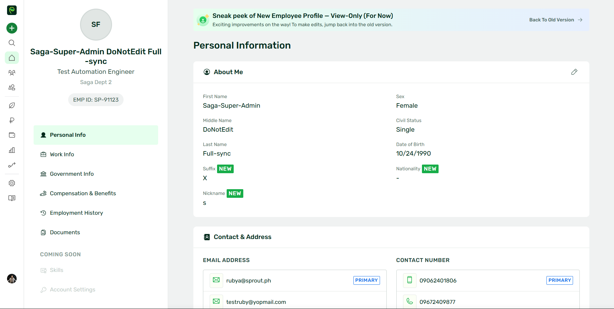

# Side Navigation

The side navigation provides a customizable navigation bar that includes a logo, navigation links, quick actions, and a search bar.



## Basic Implementation

To implement the Sidenav component, use the following syntax:

```vue
<spr-sidenav>
  <template #logo-image>
    
  </template>

  <template #logo-image>
    
  </template>
</spr-sidenav>
```

## Slots

### Custom Logo Image

The `logo-image` slot allows you to insert a custom logo in the side navigation. Use the following template to add a logo:

```vue
<template #logo-image>
  
</template>
```

### Custom Avaratar Image

The `avatar-image` slot allows you to insert a custom avatar image, typically used for the user's profile picture. Use the following template to add an avatar:

```vue
<template #avatar-image>
  
</template>
```

::: info Important to note:
Replace `[image_path]` with the actual path to your image. This slot renders the image inside the navigation bar.
:::

## Icon Component Integration

Design System provides a property `icon` that allows you to use the Icon component. You can use the Icon component to display icons in the side navigation.

Currently the Design System uses the Iconify library to display icons. You can use the Iconify icon names to display icons in the side navigation. For more information on Iconify, see the <a href="https://iconify.design/docs/usage/svg/iconify" target="_blank">Iconify documentation.</a>

---

## Navigation Links

The navigation links are organized into grouped sections, each containing several categories. Each category includes links that may have nested menus and submenus.

defining the navigation links has 2 sections, `top` and `bottom`. Each section can contain multiple `parentLinks` that represent the top-level navigation items.

```vue
<template>
  <spr-sidenav :nav-links="navLinks">
    <template #logo-image>
      
    </template>

    <template #avatar-image>
      
    </template>
  </spr-sidenav>
</template>

<script setup>
import { ref } from 'vue';

const navLinks = ref({
  top: [
    {
      parentLinks: [
        {
          title: 'Home',
          icon: 'ph:house-simple',
          menuLinks: [
            {
              menuHeading: 'Sub Heading 1',
              items: [
                {
                  title: 'Dashboard 1',
                  submenuLinks: [
                    {
                      subMenuHeading: 'Sub Heading 1',
                      items: [
                        {
                          title: 'Home 1',
                          redirect: {
                            openInNewTab: false,
                            isAbsoluteURL: true,
                            link: 'https://www.google.com/',
                          },
                        },
                        {
                          title: 'Home 2',
                          redirect: {
                            openInNewTab: false,
                            isAbsoluteURL: false,
                            link: '/',
                          },
                        },
                      ],
                    },
                    {
                      subMenuHeading: 'Sub Heading 2',
                      items: [
                        {
                          title: 'Home 3',
                          redirect: {
                            openInNewTab: false,
                            isAbsoluteURL: true,
                            link: 'https://www.google.com/',
                          },
                        },
                        {
                          title: 'Home 4',
                          redirect: {
                            openInNewTab: false,
                            isAbsoluteURL: false,
                            link: '/',
                          },
                        },
                      ],
                    },
                  ],
                },
                {
                  title: 'Dashboard 2',
                  redirect: {
                    openInNewTab: false,
                    isAbsoluteURL: false,
                    link: '/',
                  },
                },
              ],
            },
          ],
        },
      ],
    },
  ],
  bottom: [
    {
      parentLinks: [
        {
          title: 'Home',
          icon: 'ph:house-simple',
          menuLinks: [
            {
              menuHeading: 'Sub Heading 1',
              items: [
                {
                  title: 'Dashboard 1',
                  submenuLinks: [
                    {
                      subMenuHeading: 'Sub Heading 1',
                      items: [
                        {
                          title: 'Home 1',
                          redirect: {
                            openInNewTab: false,
                            isAbsoluteURL: true,
                            link: 'https://www.google.com/',
                          },
                        },
                        {
                          title: 'Home 2',
                          redirect: {
                            openInNewTab: false,
                            isAbsoluteURL: false,
                            link: '/',
                          },
                        },
                      ],
                    },
                    {
                      subMenuHeading: 'Sub Heading 2',
                      items: [
                        {
                          title: 'Home 3',
                          redirect: {
                            openInNewTab: false,
                            isAbsoluteURL: true,
                            link: 'https://www.google.com/',
                          },
                        },
                        {
                          title: 'Home 4',
                          redirect: {
                            openInNewTab: false,
                            isAbsoluteURL: false,
                            link: '/',
                          },
                        },
                      ],
                    },
                  ],
                },
                {
                  title: 'Dashboard 2',
                  redirect: {
                    openInNewTab: false,
                    isAbsoluteURL: false,
                    link: '/',
                  },
                },
              ],
            },
          ],
        },
      ],
    },
  ],
});
</script>
```

### Nav Links Structure

The nav-links attribute expects an array of objects that define the navigation menu. Each object can contain:

<ul>
  <li>
    <code class="mr-2">top:</code>
    <span> 
      You can define the top-level navigation links in the top section of the side navigation.
    </span>
  </li>
  <li>
    <code class="mr-2">bottom:</code>
    <span> 
      You can define the top-level navigation links in the bottom section of the side navigation.
    </span>
  </li>
  <li>
    <code class="mr-2">parentLinks:</code>
    <span> 
      List of top-level navigation links. Each link may contain additional properties such as a 
      <code>title</code>, 
      <code>icon</code>, <code>redirect</code> and <code>menuLinks</code>.
    </span>
  </li>
  <li>
    <code class="mr-2">title:</code>
    <span>
      The title of each nav link item. When <code>menulinks</code> is empty or not indicated. 
      Title will shows when parent link is hovered.
    </span>
  </li>
  <li>
    <code class="mr-2">icon:</code>
    <span>
      The icon associated only with <code>parentLinks</code>, usually an iconify strong (e.g., `ph:home`, `ph:users-three`).
      See more on <a href="https://iconify.design/docs/usage/svg/iconify/">Iconify</a>.
    </span>
  </li>
  <li>
    <code class="mr-2">redirect:</code>
    <span>
      The URL or path to which the user is redirected when they click on the navigation item. Redirection wont work if <code>menuLinks</code> or <code>submenuLinks</code> is present.
    </span>
  </li>
  <li>
    <code class="mr-2">openInNewTab:</code>
    <span>
      A boolean flag indicating whether the link is to open in a new tab.
    </span>
  </li>
  <li>
    <code class="mr-2">isAbsoluteURL:</code>
    <span>
      A boolean flag indicating whether the link will be open using href.
    </span>
  </li>
  <li>
    <code class="mr-2">link:</code>
    <span>
      The actual URL or destination for the navigation item, often used for internal routing or linking to different parts of the app.
    </span>
  </li>
  <li>
    <code class="mr-2">menuLinks:</code>
    <span>
      This appear under a <code>parentLinks</code> navigation item. These menu links define additional sections or categories under the parent link.
    </span>
  </li>
  <li>
    <code class="mr-2">submenuLinks:</code>
    <span>
      Links nested under the <code>menuLinks</code>, enabling multi-level navigation. These are further breakdowns or child items under each <code>menuLinks</code> section.
    </span>
  </li>
  <li>
    <code class="mr-2">hidden:</code>
    <span>
      A boolean flag indicating whether the quick action item should be hidden.
    </span>
  </li>
</ul>

<p>Here's the structure for the nav-links attribute:</p>

```Javascript
{
  top: [
    {
      parentLinks: [
        {
          title: <String>,
          icon: <String>,
          hidden: <Boleean>,
          redirect: {
            openInNewTab: <Boleean>,
            isAbsoluteURL: <Boleean>,
            link: <String>,
          },
          menuLinks: [
            {
              menuHeading: <String>,
              items: [
                {
                  title: <String>,
                  hidden: <Boleean>,
                  redirect: {
                    openInNewTab: <Boleean>,
                    isAbsoluteURL: <Boleean>,
                    link: <String>,
                  },
                  submenuLinks: [
                    {
                      subMenuHeading: <String>,
                      items: [
                        {
                          title: <String>,
                          hidden: <Boleean>,
                          redirect: {
                            openInNewTab: <Boleean>,
                            isAbsoluteURL: <Boleean>,
                            link: <String>,
                          },
                        },
                      ],
                    },
                  ],
                },
              ],
            }
          ],
        },
      ],
    },
  ],
  bottom: [
    {
      parentLinks: [
        {
          title: <String>,
          icon: <String>,
          redirect: {
            openInNewTab: <Boleean>,
            isAbsoluteURL: <Boleean>,
            link: <String>,
          },
          menuLinks: [
            {
              menuHeading: <String>,
              items: [
                {
                  title: <String>,
                  redirect: {
                    openInNewTab: <Boleean>,
                    isAbsoluteURL: <Boleean>,
                    link: <String>,
                  },
                  submenuLinks: [
                    {
                      subMenuHeading: <String>,
                      items: [
                        {
                          title: <String>,
                          redirect: {
                            openInNewTab: <Boleean>,
                            isAbsoluteURL: <Boleean>,
                            link: <String>,
                          },
                        },
                      ],
                    },
                  ],
                },
              ],
            }
          ],
        },
      ],
    },
  ]
}
```

## Active Navigation

The `active-nav` property allows you to highlight the active state across different levels of navigation (parent, menu, and submenu). To integrate it with your Sidenav component, ensure that the values for active navigation correspond to the titles of the respective items in your active navigation structure, and pass the active navigation object along with your other props.

Here’s a example of how to implement the active navigation property:

```vue
<template>
  <spr-sidenav :active-nav="activeNav" :nav-links="navLinks">
    <template #logo-image>
      
    </template>

    <template #avatar-image>
      
    </template>
  </spr-sidenav>
</template>

<script setup>
import { ref } from 'vue';

const activeNav = ref({
  parentNav: 'Home',
  menu: 'Dashboard 1',
  submenu: 'Home 2',
});

const navLinks = ref({
  top: [
    {
      parentLinks: [
        {
          title: 'Home',
          icon: 'ph:house-simple',
          menuLinks: [
            {
              menuHeading: 'Sub Heading 1',
              items: [
                {
                  title: 'Dashboard 1',
                  submenuLinks: [
                    {
                      subMenuHeading: 'Sub Heading 1',
                      items: [
                        {
                          title: 'Home 1',
                          redirect: {
                            openInNewTab: false,
                            isAbsoluteURL: true,
                            link: 'https://www.google.com/',
                          },
                        },
                        {
                          title: 'Home 2',
                          redirect: {
                            openInNewTab: false,
                            isAbsoluteURL: false,
                            link: '/',
                          },
                        },
                      ],
                    },
                    {
                      subMenuHeading: 'Sub Heading 2',
                      items: [
                        {
                          title: 'Home 3',
                          redirect: {
                            openInNewTab: false,
                            isAbsoluteURL: true,
                            link: 'https://www.google.com/',
                          },
                        },
                        {
                          title: 'Home 4',
                          redirect: {
                            openInNewTab: false,
                            isAbsoluteURL: false,
                            link: '/',
                          },
                        },
                      ],
                    },
                  ],
                },
                {
                  title: 'Dashboard 2',
                  redirect: {
                    openInNewTab: false,
                    isAbsoluteURL: false,
                    link: '/',
                  },
                },
              ],
            },
          ],
        },
      ],
    },
  ],
  bottom: [
    {
      parentLinks: [
        {
          title: 'Home',
          icon: 'ph:house-simple',
          menuLinks: [
            {
              menuHeading: 'Sub Heading 1',
              items: [
                {
                  title: 'Dashboard 1',
                  submenuLinks: [
                    {
                      subMenuHeading: 'Sub Heading 1',
                      items: [
                        {
                          title: 'Home 1',
                          redirect: {
                            openInNewTab: false,
                            isAbsoluteURL: true,
                            link: 'https://www.google.com/',
                          },
                        },
                        {
                          title: 'Home 2',
                          redirect: {
                            openInNewTab: false,
                            isAbsoluteURL: false,
                            link: '/',
                          },
                        },
                      ],
                    },
                    {
                      subMenuHeading: 'Sub Heading 2',
                      items: [
                        {
                          title: 'Home 3',
                          redirect: {
                            openInNewTab: false,
                            isAbsoluteURL: true,
                            link: 'https://www.google.com/',
                          },
                        },
                        {
                          title: 'Home 4',
                          redirect: {
                            openInNewTab: false,
                            isAbsoluteURL: false,
                            link: '/',
                          },
                        },
                      ],
                    },
                  ],
                },
                {
                  title: 'Dashboard 2',
                  redirect: {
                    openInNewTab: false,
                    isAbsoluteURL: false,
                    link: '/',
                  },
                },
              ],
            },
          ],
        },
      ],
    },
  ],
});
</script>
```

## Quick Actions

This feature allows you to add quick action buttons to the side navigation. Each quick action button can have a title, description, icon, and redirection link.

::: info Important to note:
The `iconBgColor` property currently can only handle 2 values `green` or `purple`.
:::

```vue
<template>
  <spr-sidenav :quick-actions="quickActions" :active-nav="activeNav" :nav-links="navLinks">
    <template #logo-image>
      
    </template>

    <template #avatar-image>
      
    </template>
  </spr-sidenav>
</template>

<script setup>
import { ref } from 'vue';

const quickActions = ref([
  {
    menuHeading: 'Sub Heading 1',
    items: [
      {
        title: 'Leave Request',
        description: 'Lorem ipsum dolor sit amet consectetur.',
        icon: 'ph:house-simple',
        iconBgColor: 'purple',
        redirect: {
          openInNewTab: false,
          isAbsoluteURL: false,
          link: '/',
        },
      },
      {
        title: 'Onboarding Request',
        description: 'Seamlessly onboard new employees into your Sprout ecosystem',
        icon: 'ph:house-simple',
        iconBgColor: 'purple',
        redirect: {
          openInNewTab: false,
          isAbsoluteURL: false,
          link: '/',
        },
      },
      {
        title: 'Certificate of Employee',
        description: 'Lorem ipsum dolor sit amet consectetur. ',
        icon: 'ph:house-simple',
        iconBgColor: 'purple',
        redirect: {
          openInNewTab: false,
          isAbsoluteURL: false,
          link: '/',
        },
      },
    ],
  },
  {
    menuHeading: 'Sub Heading 2',
    items: [
      {
        title: 'ReadyWage',
        description: 'Request Form',
        icon: 'ph:house-simple',
        iconBgColor: 'purple',
        redirect: {
          openInNewTab: false,
          isAbsoluteURL: false,
          link: '/',
        },
      },
      {
        title: 'Create Workflow',
        description: 'Access your hard-earned salary in advance',
        icon: 'ph:house-simple',
        iconBgColor: 'purple',
        redirect: {
          openInNewTab: false,
          isAbsoluteURL: false,
          link: '/',
        },
      },
      {
        title: 'Create Something 1',
        description: 'Lorem ipsum dolor sit amet consectetur.',
        icon: 'ph:house-simple',
        iconBgColor: 'purple',
        redirect: {
          openInNewTab: false,
          isAbsoluteURL: false,
          link: '/',
        },
      },
      {
        title: 'Create Something 2',
        description: 'Lorem ipsum dolor sit amet consectetur.',
        icon: 'ph:house-simple',
        iconBgColor: 'purple',
        redirect: {
          openInNewTab: false,
          isAbsoluteURL: false,
          link: '/',
        },
      },
    ],
  },
]);

const activeNav = ref({
  parentNav: 'Home',
  menu: 'Dashboard 1',
  submenu: 'Home 2',
});

const navLinks = ref({
  top: [
    {
      parentLinks: [
        {
          title: 'Home',
          icon: 'ph:house-simple',
          menuLinks: [
            {
              menuHeading: 'Sub Heading 1',
              items: [
                {
                  title: 'Dashboard 1',
                  submenuLinks: [
                    {
                      subMenuHeading: 'Sub Heading 1',
                      items: [
                        {
                          title: 'Home 1',
                          redirect: {
                            openInNewTab: false,
                            isAbsoluteURL: true,
                            link: 'https://www.google.com/',
                          },
                        },
                        {
                          title: 'Home 2',
                          redirect: {
                            openInNewTab: false,
                            isAbsoluteURL: false,
                            link: '/',
                          },
                        },
                      ],
                    },
                    {
                      subMenuHeading: 'Sub Heading 2',
                      items: [
                        {
                          title: 'Home 3',
                          redirect: {
                            openInNewTab: false,
                            isAbsoluteURL: true,
                            link: 'https://www.google.com/',
                          },
                        },
                        {
                          title: 'Home 4',
                          redirect: {
                            openInNewTab: false,
                            isAbsoluteURL: false,
                            link: '/',
                          },
                        },
                      ],
                    },
                  ],
                },
                {
                  title: 'Dashboard 2',
                  redirect: {
                    openInNewTab: false,
                    isAbsoluteURL: false,
                    link: '/',
                  },
                },
              ],
            },
          ],
        },
      ],
    },
  ],
  bottom: [
    {
      parentLinks: [
        {
          title: 'Home',
          icon: 'ph:house-simple',
          menuLinks: [
            {
              menuHeading: 'Sub Heading 1',
              items: [
                {
                  title: 'Dashboard 1',
                  submenuLinks: [
                    {
                      subMenuHeading: 'Sub Heading 1',
                      items: [
                        {
                          title: 'Home 1',
                          redirect: {
                            openInNewTab: false,
                            isAbsoluteURL: true,
                            link: 'https://www.google.com/',
                          },
                        },
                        {
                          title: 'Home 2',
                          redirect: {
                            openInNewTab: false,
                            isAbsoluteURL: false,
                            link: '/',
                          },
                        },
                      ],
                    },
                    {
                      subMenuHeading: 'Sub Heading 2',
                      items: [
                        {
                          title: 'Home 3',
                          redirect: {
                            openInNewTab: false,
                            isAbsoluteURL: true,
                            link: 'https://www.google.com/',
                          },
                        },
                        {
                          title: 'Home 4',
                          redirect: {
                            openInNewTab: false,
                            isAbsoluteURL: false,
                            link: '/',
                          },
                        },
                      ],
                    },
                  ],
                },
                {
                  title: 'Dashboard 2',
                  redirect: {
                    openInNewTab: false,
                    isAbsoluteURL: false,
                    link: '/',
                  },
                },
              ],
            },
          ],
        },
      ],
    },
  ],
});
</script>
```

## Search

Side navigation also includes a search functionality. Add `has-search` property to enable the search.

Using the `@search` event, you can handle the search functionality.

```vue
<template>
  <spr-sidenav has-search @search="handleSearch">
    <template #logo-image>
      
    </template>

    <template #avatar-image>
      
    </template>
  </spr-sidenav>
</template>

<script setup>
const handleSearch = (search) => {
  console.log(search);
};
</script>
```

## Notifications & Requests

Side navigation also includes a notification and request counter badge. Add `notification-count` or `request-count` attribute to the component to enable the notification or request counter.

Using the `@notifications` or `@requests` event, you can handle the notification functionality.

```vue
<template>
  <spr-sidenav
    :notification-count="5"
    :request-count="10"
    @notifications="handleNotifications"
    @requests="handleRequest"
  >
    <template #logo-image>
      
    </template>

    <template #avatar-image>
      
    </template>
  </spr-sidenav>
</template>

<script setup>
const handleNotifications = (notifications) => {
  console.log(notifications);
};

const handleRequest = (request) => {
  console.log(request);
};
</script>
```

## User Menu

The user menu allows you to add a user avatar at the bottom of the side navigation along with a menu. The user menu can contain items such as profile, settings, and logout.

```vue
<template>
  <spr-sidenav :user-menu="userMenu">
    <template #logo-image>
      
    </template>

    <template #avatar-image>
      
    </template>
  </spr-sidenav>
</template>

<script setup>
import { ref } from 'vue';

const userMenu = ref({
  name: 'John Rafael M. Arias',
  email: 'jarias@sprout.ph',
  profileImage: 'https://lh3.googleusercontent.com/ogw/AF2bZyiCP8eaKX7KiduREcMAogl0Ml2TwYJAPTgcKeNap81ztg=s32-c-mo',
  items: [
    {
      title: 'My Profile',
      icon: 'ph:house-simple',
      redirect: {
        openInNewTab: false,
        isAbsoluteURL: false,
        link: '/',
      },
    },
    {
      title: 'Privacy Policy',
      icon: 'ph:house-simple',
      redirect: {
        openInNewTab: false,
        isAbsoluteURL: false,
        link: '/',
      },
    },
    {
      title: 'Terms of Service',
      icon: 'ph:house-simple',
      redirect: {
        openInNewTab: false,
        isAbsoluteURL: false,
        link: '/',
      },
    },
    {
      title: 'Logout',
      icon: 'ph:house-simple',
      redirect: {
        openInNewTab: false,
        isAbsoluteURL: false,
        link: '/',
      },
    },
  ],
});
</script>
```

## Sidenav API

The following table outlines the available attributes for the Sidenav component:

<table>
  <thead>
    <tr>
      <td class="min-w-[180px]">Attribute</td>
      <td>Description</td>
      <td>Type</td>
      <td>Accepted Values</td>
    </tr>
  </thead>
  <tbody>
    <tr>
      <td>
        <code>quick-actions</code>
      </td>
      <td>Shows quick action menu.</td>
      <td>Array</td>
      <td>
        [
          {
            title: [string],
            description: [string],
            icon: [string],
            iconBgColor: ['green' | 'purple'],
            redirect: {
              openInNewTab: [boolean],
              isAbsoluteURL: [boolean],
              link: [string],
            },
          },
        ]
      </td>
    </tr>
    <tr>
      <td>
        <code>has-search</code>
      </td>
      <td>Shows search button.</td>
      <td>boolean</td>
      <td>true | false</td>
    </tr>
    <tr>
      <td>
        <code>active-nav</code>
      </td>
      <td>Set the active state for navigation, including the parent navigation, menu, and submenu.</td>
      <td>Object</td>
      <td>
        {
          parentNav: [string],
          menu: [string],
          submenu: [string],
        }
      </td>
    </tr>
    <tr>
      <td>
        <code>nav-links</code>
      </td>
      <td>Will generate navigation links including submenu links.</td>
      <td>Array</td>
      <td>See <a href="#navigation-links">Navigation Link</a></td>
    </tr>
    <tr>
      <td>
        <code>notification-count</code>
      </td>
      <td>Show notification counter badge</td>
      <td>Number</td>
      <td>Integer</td>
    </tr>
    <tr>
      <td>
        <code>request-count</code>
      </td>
      <td>Show request counter badge</td>
      <td>Number</td>
      <td>Integer</td>
    </tr>
    <tr>
      <td>
        <code>user-menu</code>
      </td>
      <td>Shows user avatar at the bottom of the sidenavigation along with a menu.</td>
      <td>-</td>
      <td>See <a href="#user-menu">User Menu</a></td>
    </tr>
    <tr>
      <td>
        <code>@get-navlink-item</code>
      </td>
      <td>Will return link that is indicated in nav-links. This will be the conection to handle your router push.</td>
      <td>-</td>
      <td>function</td>
    </tr>
    <tr>
      <td>
        <code>@search</code>
      </td>
      <td>Handle the search functionality.</td>
      <td>-</td>
      <td>function</td>
    </tr>
    <tr>
      <td>
        <code>@notifications</code>
      </td>
      <td>Handle the notifications functionality.</td>
      <td>-</td>
      <td>function</td>
    </tr>
    <tr>
      <td>
        <code>@requests</code>
      </td>
      <td>Handle the requests functionality.</td>
      <td>-</td>
      <td>function</td>
    </tr>
  </tbody>
</table>

## Full Example

Here’s a full example of how to implement the Sidenav component with the above attributes:

<div class="no-darkmode m-0 bg-mushroom-100 text-mushroom-950 font-main rounded-md h-[100vh] w-full relative flex">
  <spr-sidenav 
    class="absolute z-[1]" 
    :quick-actions="quickActions"
    has-search
    :active-nav="activeNav"
    :nav-links="navLinks"
    :notification-count="5"
    :request-count="10"
    :user-menu="userMenu"
    @get-navlink-item="handleGetNavLinkItem"
    @search="handleSearch"
    @notifications="handleNotifications"
  >
    <template #logo-image>
      
    </template>
    <template #avatar-image>
      
    </template>
  </spr-sidenav>
  <div class="flex-1 px-4 py-4 w-full max-w-[calc(100%-60px)] ml-[60px] overflow-auto">
    <h1>Lorem Ipsum</h1>
    <p>
      Lorem ipsum dolor sit amet, consectetur adipiscing elit. Morbi quis est in quam efficitur tempor. Integer blandit egestas risus, non consequat massa rhoncus eget. Donec commodo luctus diam, egestas scelerisque justo fermentum vel. Morbi vestibulum quis arcu sit amet sollicitudin. Vestibulum fringilla et risus at porttitor. Sed at augue non nunc tempus sagittis quis a magna. Mauris lacinia neque massa, sed fermentum libero dignissim et. Vivamus faucibus aliquet arcu, a viverra leo vehicula at. Aliquam ut turpis vitae mi scelerisque blandit in non diam. Nulla molestie, ipsum id interdum auctor, sem odio bibendum turpis, sed accumsan nisl nunc id lacus. Vestibulum ante eros, accumsan sit amet mollis et, fermentum at est. In hac habitasse platea dictumst.
    </p>
    <p>
      Morbi posuere orci arcu, efficitur maximus ante eleifend ut. Aliquam suscipit finibus dui a pellentesque. Praesent vel nulla turpis. Nullam gravida diam vitae lectus consectetur euismod. Pellentesque ut leo lorem. Integer nec feugiat lorem. Nam sodales nibh ut varius rutrum. Donec vel gravida purus. Aliquam dictum, elit a maximus scelerisque, lorem odio facilisis odio, volutpat interdum diam mauris vitae massa. Nunc ornare ligula eu diam bibendum finibus. Nullam maximus convallis ornare. Curabitur dolor magna, euismod at dui pretium, feugiat aliquet mi. Nullam tincidunt sapien ante, ac efficitur eros lobortis a.
    </p>
    <p>
      Nulla lacinia fermentum fermentum. Sed lorem leo, pulvinar laoreet augue vel, rhoncus sollicitudin enim. Donec vel viverra neque. Ut at ante a massa commodo consequat quis tristique diam. Duis erat ipsum, pellentesque nec urna vitae, sodales pretium dui. Quisque ullamcorper consequat lorem. Duis bibendum dapibus velit, sed pulvinar risus ornare nec. Morbi sagittis sit amet libero quis rutrum. Curabitur finibus ullamcorper nisl nec blandit. Vestibulum placerat ex leo, vel efficitur risus vehicula et. Nam non nibh dui. Sed eu pellentesque ligula, id semper massa. Sed eu nunc fringilla, posuere diam a, porttitor eros.
    </p>
    <p>
      Nulla faucibus eros eget convallis ullamcorper. Nam nec vehicula ipsum, ut pulvinar diam. Suspendisse sit amet metus rhoncus, pulvinar arcu quis, tincidunt lectus. Proin a mi quam. Aenean vitae massa dignissim lacus ultrices faucibus. Etiam ut bibendum quam. Vestibulum ut placerat neque. Aliquam laoreet congue lacus a semper. Suspendisse sed elementum diam. Nullam faucibus urna iaculis, suscipit arcu sit amet, elementum ligula. Duis at velit sed arcu condimentum porta ut id sem. Donec et odio ut purus viverra semper.
    </p>
    <p>
      Integer quam magna, semper sed vehicula eu, maximus ut mauris. Quisque non dolor ornare, pulvinar ex id, imperdiet velit. Suspendisse potenti. In dignissim nibh ut tortor interdum accumsan a sit amet ante. Morbi vehicula odio nulla, ac fermentum augue congue at. Nulla volutpat interdum ex et aliquet. Duis pharetra tellus sit amet nisl congue molestie.
    </p>
  </div>
</div>

```vue
<template>
  <spr-sidenav
    :quick-actions="quickActions"
    has-search
    :active-nav="activeNav"
    :nav-links="navLinks"
    :notification-count="5"
    :request-count="10"
    :user-menu="userMenu"
    @get-navlink-item="handleGetNavLinkItem"
    @search="handleSearch"
    @notifications="handleNotifications"
  >
    <template #logo-image>
      
    </template>

    <template #avatar-image>
      
    </template>
  </spr-sidenav>
</template>

<script setup lang="ts">
import { ref } from 'vue';

import SprSidenav from '@/components/sidenav/sidenav.vue';

const quickActions = ref([
  {
    menuHeading: 'Sub Heading 1',
    items: [
      {
        title: 'Leave Request',
        description: 'Lorem ipsum dolor sit amet consectetur.',
        icon: 'ph:house-simple',
        iconBgColor: 'purple',
        redirect: {
          openInNewTab: false,
          isAbsoluteURL: false,
          link: '/',
        },
      },
      {
        title: 'Onboarding Request',
        description: 'Seamlessly onboard new employees into your Sprout ecosystem',
        icon: 'ph:house-simple',
        iconBgColor: 'purple',
        redirect: {
          openInNewTab: false,
          isAbsoluteURL: false,
          link: '/',
        },
      },
      {
        title: 'Certificate of Employee',
        description: 'Lorem ipsum dolor sit amet consectetur. ',
        icon: 'ph:house-simple',
        iconBgColor: 'purple',
        redirect: {
          openInNewTab: false,
          isAbsoluteURL: false,
          link: '/',
        },
      },
    ],
  },
  {
    menuHeading: 'Sub Heading 2',
    items: [
      {
        title: 'ReadyWage',
        description: 'Request Form',
        icon: 'ph:house-simple',
        iconBgColor: 'purple',
        redirect: {
          openInNewTab: false,
          isAbsoluteURL: false,
          link: '/',
        },
      },
      {
        title: 'Create Workflow',
        description: 'Access your hard-earned salary in advance',
        icon: 'ph:house-simple',
        iconBgColor: 'purple',
        redirect: {
          openInNewTab: false,
          isAbsoluteURL: false,
          link: '/',
        },
      },
      {
        title: 'Create Something 1',
        description: 'Lorem ipsum dolor sit amet consectetur.',
        icon: 'ph:house-simple',
        iconBgColor: 'purple',
        redirect: {
          openInNewTab: false,
          isAbsoluteURL: false,
          link: '/',
        },
      },
      {
        title: 'Create Something 2',
        description: 'Lorem ipsum dolor sit amet consectetur.',
        icon: 'ph:house-simple',
        iconBgColor: 'purple',
        redirect: {
          openInNewTab: false,
          isAbsoluteURL: false,
          link: '/',
        },
      },
    ],
  },
]);

const activeNav = ref({
  parentNav: 'Home',
  menu: 'Dashboard 1',
  submenu: 'Home 2',
});

const navLinks = ref({
  top: [
    {
      parentLinks: [
        {
          title: 'Home',
          icon: 'ph:house-simple',
          menuLinks: [
            {
              menuHeading: 'Sub Heading 1',
              items: [
                {
                  title: 'Dashboard 1',
                  submenuLinks: [
                    {
                      subMenuHeading: 'Sub Heading 1',
                      items: [
                        {
                          title: 'Home 1',
                          redirect: {},
                        },
                        {
                          title: 'Home 2',
                          redirect: {
                            openInNewTab: false,
                            isAbsoluteURL: false,
                            link: '/',
                          },
                        },
                      ],
                    },
                    {
                      subMenuHeading: 'Sub Heading 2',
                      items: [
                        {
                          title: 'Home 3',
                          redirect: {
                            openInNewTab: false,
                            isAbsoluteURL: true,
                            link: 'https://www.google.com/',
                          },
                        },
                        {
                          title: 'Home 4',
                          redirect: {
                            openInNewTab: false,
                            isAbsoluteURL: false,
                            link: '/',
                          },
                        },
                      ],
                    },
                  ],
                },
                {
                  title: 'Dashboard 2',
                  redirect: {
                    openInNewTab: false,
                    isAbsoluteURL: false,
                    link: '/',
                  },
                },
              ],
            },
          ],
        },
        {
          title: 'Employees',
          icon: 'ph:users-three',
          redirect: {
            openInNewTab: false,
            isAbsoluteURL: false,
            link: '/',
          },
        },
      ],
    },
    {
      parentLinks: [
        {
          title: 'Payroll',
          icon: 'ph:leaf',
          menuLinks: [
            {
              menuHeading: 'Sub Heading 1',
              items: [
                {
                  title: 'Payroll Runs',
                  redirect: {
                    openInNewTab: false,
                    isAbsoluteURL: false,
                    link: '/',
                  },
                },
                {
                  title: 'Reports',
                  submenuLinks: [
                    {
                      subMenuHeading: '',
                      items: [
                        {
                          title: 'Payroll',
                          redirect: {
                            openInNewTab: false,
                            isAbsoluteURL: false,
                            link: '/',
                          },
                        },
                        {
                          title: 'SSS',
                          redirect: {
                            openInNewTab: false,
                            isAbsoluteURL: false,
                            link: '/',
                          },
                        },
                        {
                          title: 'PHILHEALTH',
                          redirect: {
                            openInNewTab: false,
                            isAbsoluteURL: false,
                            link: '/',
                          },
                        },
                      ],
                    },
                  ],
                },
              ],
            },
            {
              menuHeading: 'Sub Heading 2',
              items: [
                {
                  title: 'Setup',
                  redirect: {
                    openInNewTab: false,
                    isAbsoluteURL: false,
                    link: '/',
                  },
                },
                {
                  title: 'Employees',
                  redirect: {
                    openInNewTab: false,
                    isAbsoluteURL: false,
                    link: '/',
                  },
                },
              ],
            },
          ],
        },
        {
          title: 'Money',
          icon: 'ph:currency-rub',
          redirect: {
            openInNewTab: false,
            isAbsoluteURL: false,
            link: '/',
          },
        },
        {
          title: 'Car',
          icon: 'ph:wallet',
          redirect: {
            openInNewTab: false,
            isAbsoluteURL: false,
            link: '/',
          },
          menuLinks: [
            {
              menuHeading: '',
              items: [
                {
                  title: 'Car 1',
                  redirect: {
                    openInNewTab: false,
                    isAbsoluteURL: false,
                    link: '/',
                  },
                },
                {
                  title: 'Car 2',
                  redirect: {
                    openInNewTab: false,
                    isAbsoluteURL: false,
                    link: '/',
                  },
                },
              ],
            },
          ],
        },
      ],
    },
  ],
  bottom: [
    {
      parentLinks: [
        {
          title: 'Gallery',
          icon: 'ph:address-book',
          menuLinks: [
            {
              menuHeading: 'Sub Heading 1',
              items: [
                {
                  title: 'Dashboard 1',
                  submenuLinks: [
                    {
                      subMenuHeading: 'Sub Heading 1',
                      items: [
                        {
                          title: 'Home 1',
                          redirect: {},
                        },
                        {
                          title: 'Home 2',
                          redirect: {
                            openInNewTab: false,
                            isAbsoluteURL: false,
                            link: '/',
                          },
                        },
                      ],
                    },
                    {
                      subMenuHeading: 'Sub Heading 2',
                      items: [
                        {
                          title: 'Home 3',
                          redirect: {
                            openInNewTab: false,
                            isAbsoluteURL: true,
                            link: 'https://www.google.com/',
                          },
                        },
                        {
                          title: 'Home 4',
                          redirect: {
                            openInNewTab: false,
                            isAbsoluteURL: false,
                            link: '/',
                          },
                        },
                      ],
                    },
                  ],
                },
                {
                  title: 'Dashboard 2',
                  redirect: {
                    openInNewTab: false,
                    isAbsoluteURL: false,
                    link: '/',
                  },
                },
              ],
            },
          ],
        },
      ],
    },
    {
      parentLinks: [
        {
          title: 'Resources',
          icon: 'ph:alien',
          redirect: {
            openInNewTab: false,
            isAbsoluteURL: false,
            link: '/',
          },
        },
        {
          title: 'News',
          icon: 'ph:align-left',
          redirect: {
            openInNewTab: false,
            isAbsoluteURL: false,
            link: '/',
          },
        },
      ],
    },
  ],
});

const handleGetNavLinkItem = (route) => {
  console.log(route);
};

const handleSearch = (search) => {
  console.log(search);
};

const handleNotifications = (notifications) => {
  console.log(notifications);
};

const handleRequest = (request) => {
  console.log(request);
};

const userMenu = ref({
  name: 'John Rafael M. Arias',
  email: 'jarias@sprout.ph',
  profileImage: 'https://lh3.googleusercontent.com/ogw/AF2bZyiCP8eaKX7KiduREcMAogl0Ml2TwYJAPTgcKeNap81ztg=s32-c-mo',
  items: [
    {
      title: 'My Profile',
      icon: 'ph:house-simple',
      redirect: {
        openInNewTab: false,
        isAbsoluteURL: false,
        link: '/',
      },
    },
    {
      title: 'Privacy Policy',
      icon: 'ph:house-simple',
      redirect: {
        openInNewTab: false,
        isAbsoluteURL: false,
        link: '/',
      },
    },
    {
      title: 'Terms of Service',
      icon: 'ph:house-simple',
      redirect: {
        openInNewTab: false,
        isAbsoluteURL: false,
        link: '/',
      },
    },
    {
      title: 'Logout',
      icon: 'ph:house-simple',
      redirect: {
        openInNewTab: false,
        isAbsoluteURL: false,
        link: '/',
      },
    },
  ],
});
</script>
```

<script lang="ts" setup>
import { ref } from 'vue';

import SprSidenav from '@/components/sidenav/sidenav.vue';

const quickActions = ref([
  {
    menuHeading: 'Sub Heading 1',
    items: [
      {
        title: 'Leave Request',
        description: 'Lorem ipsum dolor sit amet consectetur.',
        icon: 'ph:house-simple',
        iconBgColor: 'purple',
        redirect: {
          openInNewTab: false,
          isAbsoluteURL: false,
          link: '/',
        },
      },
      {
        title: 'Onboarding Request',
        description: 'Seamlessly onboard new employees into your Sprout ecosystem',
        icon: 'ph:house-simple',
        iconBgColor: 'purple',
        redirect: {
          openInNewTab: false,
          isAbsoluteURL: false,
          link: '/',
        },
      },
      {
        title: 'Certificate of Employee',
        description: 'Lorem ipsum dolor sit amet consectetur. ',
        icon: 'ph:house-simple',
        iconBgColor: 'purple',
        redirect: {
          openInNewTab: false,
          isAbsoluteURL: false,
          link: '/',
        },
      },
    ],
  },
  {
    menuHeading: 'Sub Heading 2',
    items: [
      {
        title: 'ReadyWage',
        description: 'Request Form',
        icon: 'ph:house-simple',
        iconBgColor: 'purple',
        redirect: {
          openInNewTab: false,
          isAbsoluteURL: false,
          link: '/',
        },
      },
      {
        title: 'Create Workflow',
        description: 'Access your hard-earned salary in advance',
        icon: 'ph:house-simple',
        iconBgColor: 'purple',
        redirect: {
          openInNewTab: false,
          isAbsoluteURL: false,
          link: '/',
        },
      },
      {
        title: 'Create Something 1',
        description: 'Lorem ipsum dolor sit amet consectetur.',
        icon: 'ph:house-simple',
        iconBgColor: 'purple',
        redirect: {
          openInNewTab: false,
          isAbsoluteURL: false,
          link: '/',
        },
      },
      {
        title: 'Create Something 2',
        description: 'Lorem ipsum dolor sit amet consectetur.',
        icon: 'ph:house-simple',
        iconBgColor: 'purple',
        redirect: {
          openInNewTab: false,
          isAbsoluteURL: false,
          link: '/',
        },
      },
    ],
  },
]);

const activeNav = ref({
  parentNav: 'Home',
  menu: 'Dashboard 1',
  submenu: 'Home 2',
});

const navLinks = ref({
  top: [
    {
      parentLinks: [
        {
          title: 'Home',
          icon: 'ph:house-simple',
          menuLinks: [
            {
              menuHeading: 'Sub Heading 1',
              items: [
                {
                  title: 'Dashboard 1',
                  submenuLinks: [
                    {
                      subMenuHeading: 'Sub Heading 1',
                      items: [
                        {
                          title: 'Home 1',
                          redirect: {},
                        },
                        {
                          title: 'Home 2',
                          redirect: {
                            openInNewTab: false,
                            isAbsoluteURL: false,
                            link: '/',
                          },
                        },
                      ],
                    },
                    {
                      subMenuHeading: 'Sub Heading 2',
                      items: [
                        {
                          title: 'Home 3',
                          redirect: {
                            openInNewTab: false,
                            isAbsoluteURL: true,
                            link: 'https://www.google.com/',
                          },
                        },
                        {
                          title: 'Home 4',
                          redirect: {
                            openInNewTab: false,
                            isAbsoluteURL: false,
                            link: '/',
                          },
                        },
                      ],
                    },
                  ],
                },
                {
                  title: 'Dashboard 2',
                  redirect: {
                    openInNewTab: false,
                    isAbsoluteURL: false,
                    link: '/',
                  },
                },
              ],
            },
          ],
        },
        {
          title: 'Employees',
          icon: 'ph:users-three',
          redirect: {
            openInNewTab: false,
            isAbsoluteURL: false,
            link: '/',
          },
        },
      ],
    },
    {
      parentLinks: [
        {
          title: 'Payroll',
          icon: 'ph:leaf',
          menuLinks: [
            {
              menuHeading: 'Sub Heading 1',
              items: [
                {
                  title: 'Payroll Runs',
                  redirect: {
                    openInNewTab: false,
                    isAbsoluteURL: false,
                    link: '/',
                  },
                },
                {
                  title: 'Reports',
                  submenuLinks: [
                    {
                      subMenuHeading: '',
                      items: [
                        {
                          title: 'Payroll',
                          redirect: {
                            openInNewTab: false,
                            isAbsoluteURL: false,
                            link: '/',
                          },
                        },
                        {
                          title: 'SSS',
                          redirect: {
                            openInNewTab: false,
                            isAbsoluteURL: false,
                            link: '/',
                          },
                        },
                        {
                          title: 'PHILHEALTH',
                          redirect: {
                            openInNewTab: false,
                            isAbsoluteURL: false,
                            link: '/',
                          },
                        },
                      ],
                    },
                  ],
                },
              ],
            },
            {
              menuHeading: 'Sub Heading 2',
              items: [
                {
                  title: 'Setup',
                  redirect: {
                    openInNewTab: false,
                    isAbsoluteURL: false,
                    link: '/',
                  },
                },
                {
                  title: 'Employees',
                  redirect: {
                    openInNewTab: false,
                    isAbsoluteURL: false,
                    link: '/',
                  },
                },
              ],
            },
          ],
        },
        {
          title: 'Money',
          icon: 'ph:currency-rub',
          redirect: {
            openInNewTab: false,
            isAbsoluteURL: false,
            link: '/',
          },
        },
        {
          title: 'Car',
          icon: 'ph:wallet',
          redirect: {
            openInNewTab: false,
            isAbsoluteURL: false,
            link: '/',
          },
          menuLinks: [
            {
              menuHeading: '',
              items: [
                {
                  title: 'Car 1',
                  redirect: {
                    openInNewTab: false,
                    isAbsoluteURL: false,
                    link: '/',
                  },
                },
                {
                  title: 'Car 2',
                  redirect: {
                    openInNewTab: false,
                    isAbsoluteURL: false,
                    link: '/',
                  },
                },
              ],
            },
          ],
        },
      ],
    },
  ],
  bottom: [
    {
      parentLinks: [
        {
          title: 'Gallery',
          icon: 'ph:address-book',
          menuLinks: [
            {
              menuHeading: 'Sub Heading 1',
              items: [
                {
                  title: 'Dashboard 1',
                  submenuLinks: [
                    {
                      subMenuHeading: 'Sub Heading 1',
                      items: [
                        {
                          title: 'Home 1',
                          redirect: {},
                        },
                        {
                          title: 'Home 2',
                          redirect: {
                            openInNewTab: false,
                            isAbsoluteURL: false,
                            link: '/',
                          },
                        },
                      ],
                    },
                    {
                      subMenuHeading: 'Sub Heading 2',
                      items: [
                        {
                          title: 'Home 3',
                          redirect: {
                            openInNewTab: false,
                            isAbsoluteURL: true,
                            link: 'https://www.google.com/',
                          },
                        },
                        {
                          title: 'Home 4',
                          redirect: {
                            openInNewTab: false,
                            isAbsoluteURL: false,
                            link: '/',
                          },
                        },
                      ],
                    },
                  ],
                },
                {
                  title: 'Dashboard 2',
                  redirect: {
                    openInNewTab: false,
                    isAbsoluteURL: false,
                    link: '/',
                  },
                },
              ],
            },
          ],
        },
      ],
    },
    {
      parentLinks: [
        {
          title: 'Resources',
          icon: 'ph:alien',
          redirect: {
            openInNewTab: false,
            isAbsoluteURL: false,
            link: '/',
          },
        },
        {
          title: 'News',
          icon: 'ph:align-left',
          redirect: {
            openInNewTab: false,
            isAbsoluteURL: false,
            link: '/',
          },
        },
      ],
    },
  ],
});

const handleGetNavLinkItem = (route) => {
  console.log(route);
};

const handleSearch = (search) => {
  console.log(search);
};

const handleNotifications = (notifications) => {
  console.log(notifications);
};

const handleRequest = (request) => {
  console.log(request);
};

const userMenu = ref({
  name: 'John Rafael M. Arias',
  email: 'jarias@sprout.ph',
  profileImage: 'https://lh3.googleusercontent.com/ogw/AF2bZyiCP8eaKX7KiduREcMAogl0Ml2TwYJAPTgcKeNap81ztg=s32-c-mo',
  items: [
    {
      title: 'My Profile',
      icon: 'ph:house-simple',
      redirect: {
        openInNewTab: false,
        isAbsoluteURL: false,
        link: '/',
      },
    },
    {
      title: 'Privacy Policy',
      icon: 'ph:house-simple',
      redirect: {
        openInNewTab: false,
        isAbsoluteURL: false,
        link: '/',
      },
    },
    {
      title: 'Terms of Service',
      icon: 'ph:house-simple',
      redirect: {
        openInNewTab: false,
        isAbsoluteURL: false,
        link: '/',
      },
    },
    {
      title: 'Logout',
      icon: 'ph:house-simple',
      redirect: {
        openInNewTab: false,
        isAbsoluteURL: false,
        link: '/',
      },
    },
  ],
});
</script>
