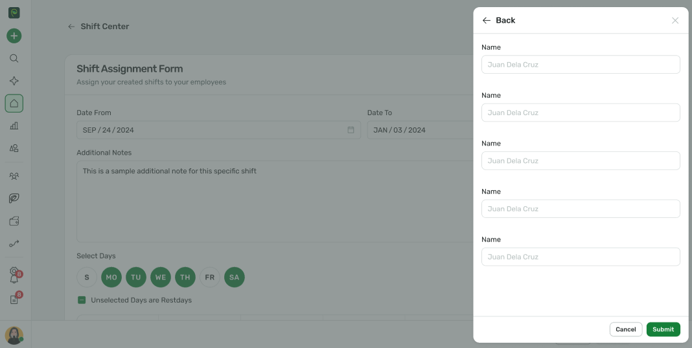

# Sidepanel

The Sidepanel component is a reusable UI element designed to display contextual or additional information alongside the main content of your application. It slides into view from the edge of the screen, providing a seamless and non-intrusive way to present content such as forms, lists, or detailed views.



## Basic Usage

<div>
  <spr-button tone="success" @click="isSidepanelOpen = true">Open Sidepanel</spr-button>
  <spr-sidepanel 
    :is-open="isSidepanelOpen"
    @close="isSidepanelOpen = false"
    header-title="Sidepanel Example"
  >
    Sidepanel Content
    <template #footer>
      <div class="spr-px-4 spr-flex spr-justify-end spr-gap-2">
        <spr-button>Cancel</spr-button>
        <spr-button tone="success">Submit</spr-button>
      </div>
    </template>
  </spr-sidepanel>
</div>

```vue
<template>
  <spr-button tone="success" @click="isSidepanelOpen = true">Open Sidepanel</spr-button>
  <spr-sidepanel :is-open="isSidepanelOpen" @close="isSidepanelOpen = false" header-title="Sidepanel Example">
    Sidepanel Content
    <template #footer>
      <div class="flex justify-end gap-2 px-4">
        <spr-button>Cancel</spr-button>
        <spr-button tone="success">Submit</spr-button>
      </div>
    </template>
  </spr-sidepanel>
</template>
<script setup lang="ts">
import { ref } from 'vue';

const isSidepanelOpen = ref<boolean>(false);
</script>
```

## Size

<div class="spr-flex spr-space-x-4">
  <spr-button tone="success" @click="isSmallSidepanelOpen = true">Small</spr-button>
  <spr-button tone="success" @click="isMediumSidepanelOpen = true">Medium</spr-button>
  <spr-button tone="success" @click="isLargeSidepanelOpen = true">Large</spr-button>
</div>

<div>
  <spr-sidepanel 
    size="sm"
    :is-open="isSmallSidepanelOpen"
    @close="isSmallSidepanelOpen = false"
    header-title="Sidepanel Small"
  >
    360px
  </spr-sidepanel>
  <spr-sidepanel 
    size="md"
    :is-open="isMediumSidepanelOpen"
    @close="isMediumSidepanelOpen = false"
    header-title="Sidepanel Medium"
  >
    420px
  </spr-sidepanel>
  <spr-sidepanel 
    size="lg"
    :is-open="isLargeSidepanelOpen"
    @close="isLargeSidepanelOpen = false"
    header-title="Sidepanel Large"
  >
    480px
  </spr-sidepanel>
</div>

```vue
<template>
  <div class="flex space-x-4">
    <spr-button tone="success" @click="isSmallSidepanelOpen = true">Small</spr-button>
    <spr-button tone="success" @click="isMediumSidepanelOpen = true">Medium</spr-button>
    <spr-button tone="success" @click="isLargeSidepanelOpen = true">Large</spr-button>
  </div>
  <spr-sidepanel
    size="sm"
    :is-open="isSmallSidepanelOpen"
    @close="isSmallSidepanelOpen = false"
    header-title="Sidepanel Small"
  >
    360px
  </spr-sidepanel>
  <spr-sidepanel
    size="md"
    :is-open="isMediumSidepanelOpen"
    @close="isMediumSidepanelOpen = false"
    header-title="Sidepanel Medium"
  >
    420px
  </spr-sidepanel>
  <spr-sidepanel
    size="lg"
    :is-open="isLargeSidepanelOpen"
    @close="isLargeSidepanelOpen = false"
    header-title="Sidepanel Large"
  >
    480px
  </spr-sidepanel>
</template>

<script setup lang="ts">
import { ref } from 'vue';

const isSmallSidepanelOpen = ref(false);
const isMediumSidepanelOpen = ref(false);
const isLargeSidepanelOpen = ref(false);
</script>
```

## Slot

<table>
  <thead>
    <tr>
      <td>Name</td>
      <td>Description</td>
    </tr>
  </thead>
  <tbody>
    <tr>
      <td>header</td>
      <td>Slot to customize the header content</td>
    </tr>
    <tr>
      <td>footer</td>
      <td>Slot to customize the footer content</td>
    </tr>
  </tbody>
</table>

## Attributes

## Side Panel Props

<table>
  <thead>
    <tr>
      <td>Name</td>
      <td>Description</td>
      <td>Type</td>
      <td>Default</td>
    </tr>
  </thead>
  <tbody>
    <tr>
      <td>isOpen</td>
      <td>Controls whether the side panel is open. Set to <code>true</code> to display the side panel or <code>false</code> to hide it.</td>
      <td>boolean</td>
      <td>false</td>
    </tr>
    <tr>
      <td>headerTitle</td>
      <td>The title displayed in the side panel's header.</td>
      <td>string</td>
      <td>'Sidepanel Header'</td>
    </tr>
    <tr>
      <td>size</td>
      <td>Specifies the size of the side panel.</td>
      <td>'sm' | 'md' | 'lg'</td>
      <td>'sm'</td>
    </tr>
    <tr>
      <td>height</td>
      <td>Specifies the height of the side panel.</td>
      <td>string | number</td>
      <td>'calc(100vh - 32px)'</td>
    </tr>
    <tr>
      <td>hideHeader</td>
      <td>Controls the visibility of the side panel header.</td>
      <td>boolean</td>
      <td>false</td>
    </tr>
    <tr>
      <td>hasBackdrop</td>
      <td>Determines whether a backdrop is displayed behind the side panel.</td>
      <td>boolean</td>
      <td>true</td>
    </tr>
    <tr>
      <td>closeOutside</td>
      <td>Controls whether clicking outside the side panel should close it.</td>
      <td>boolean</td>
      <td>false</td>
    </tr>
  </tbody>
</table>

## Event

<table>
  <thead>
    <tr>
      <td>Name</td>
      <td>Description</td>
    </tr>
  </thead>
  <tbody>
    <tr>
      <td>onClose</td>
      <td>Function to call when the sidepanel is closed</td>
    </tr>
  </tbody>
</table>

<script lang="ts" setup>
import { ref } from 'vue';

import SprSidepanel from '@/components/sidepanel/sidepanel.vue';
import SprButton from "@/components/button/button.vue"

const isSidepanelOpen = ref(false)
const isSmallSidepanelOpen = ref(false)
const isMediumSidepanelOpen = ref(false)
const isLargeSidepanelOpen = ref(false)
const isCustomHeaderTitleOpen = ref(false)

import SprSidenav from '@/components/sidenav/sidenav.vue';

</script>
